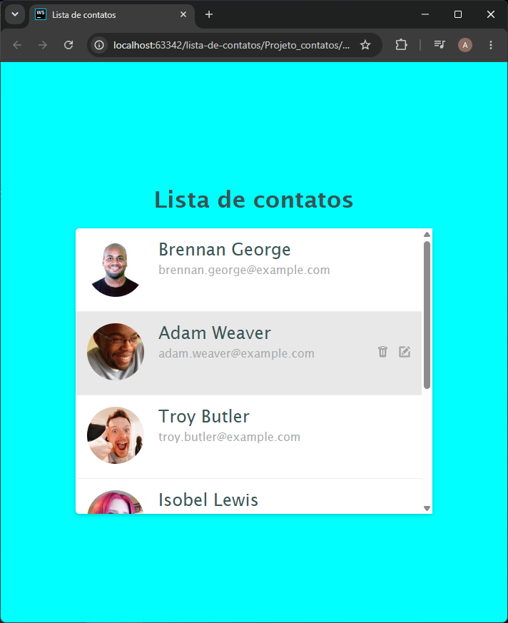
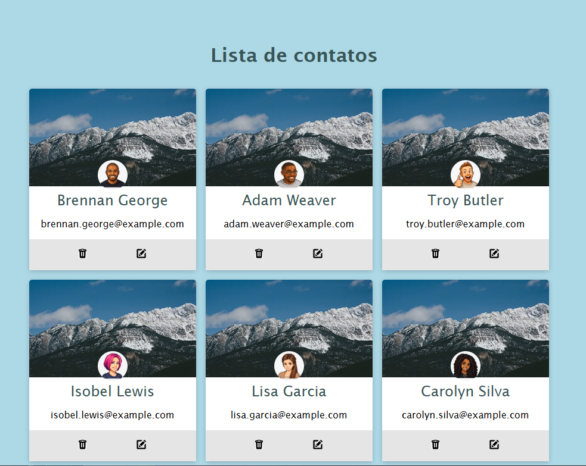

# Lista de contatos
Projeto de lista de contatos em HTML e CSS, foi criado para praticar estruturação de páginas, estilização de elementos e organização visual de interfaces.
O projeto possui duas versões da lista de contatos:
Uma versão em formato de lista vertical e uma versão em cards, com imagens de capa e avatares em pixel art. 

Preview

## Versão 1 - Lista vertical: 

## Versão 2 - Cards com pixel art:

## Tecnologias utilizadas:
* HTML5
* CSS3

## Sobre o projeto

A primeira versão apresenta uma lista de contatos com foto nome, e-mail e ícones de ação. Possui um visual simples e uma área com rolagem interna para visualizar mais contatos.
A segunda versão apresenta os contatos em formato de cards. Nessa versão, foram adicionadas imagens de capa e avatares em pixel art, deixando a interface mais personalizada. 

## Objetivo

O objetivo deste projeto de estudo foi praticar conceitos básicos de desenvolvimento front-end como:
* Estruturação de páginas com HTML;
* Estilização com CSS;
* Organização de elementos na tela;
* Uso de imagens no projeto (com banco de imagem gratuito)
* Criação de layouts diferente para mesma ideia.

✅ Projeto finalizado
